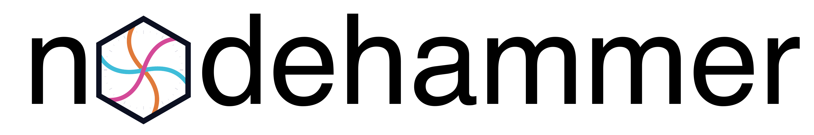

<p align="center">
  
</p>

<p align="center">
  <a href="https://github.com/paulgessinger/nodehammer/actions/workflows/ci.yml"></a>
  <a href="LICENSE"></a>
  
  
</p>

<p align="center">
  <strong>Turn High-Energy Physics detector geometry into a scene you can actually fly through.</strong>
</p>

---

Detector geometries (ROOT/TGeo, DD4hep, GDML, GeoModel, …) are huge, deeply
nested, and built for simulation — not for looking at. nodehammer converts
them into a clean, semantically-tagged scene graph and renders it in
real time with a physically-based pipeline, natively or straight in the
browser.

```
   TGeo / DD4hep ── (GDML/Geant4, GeoModel: planned)
              │
              ▼
    Semantic scene graph (.nhb / .nhb.zst)
    nodes · shapes · materials · deduplicated transforms
              │
       ┌──────┴──────┐
       ▼             ▼
  glTF / OBJ    Render IR (NHR8, FlatBuffers)
                       │
                       ▼
              Interactive viewer
        native (Metal / GLCORE / D3D11) · web (WebGPU / GLES3, wasm)
```

Every stage is driven by declarative TOML config — `keep_if`/`drop_if`
selection rules with a small predicate-expression language
(`tag.sensitive == "true" && any(path ~= "**/Pixels/**")`), material
remapping, and analytical boolean cuts — so you can go from "the whole
detector" to "just the Pixel barrel" without touching code.

## Status

nodehammer is under active, pre-1.0 development. Here's what's real today
versus what's on the roadmap.

### ✅ Implemented

- **Importers**: ROOT/TGeo and DD4hep, each independently switchable at
  build time (`NODEHAMMER_WITH_TGEO`, `NODEHAMMER_WITH_DD4HEP`).
- **Exporters**: glTF/GLB and OBJ (render IR), plus the native `.nhb`/`.nhb.zst`
  FlatBuffers semantic-scene container — a documented, zstd-compressible
  [on-disk format](docs/nhb-format.txt).
- **Analytical geometry surgery**: semantic-level azimuthal wedge cuts and
  boolean operations via [manifold](https://github.com/elalish/manifold),
  correct on non-manifold swept primitives, cooperative with UI progress.
- **CLI**: `convert`, `inspect`, `validate-config`, `config-flatten`,
  `dump-semantic`, `dump-render`, `viewer`.
- **Viewer rendering pipeline**, live today:
  - Full offscreen HDR pipeline with ACES / Reinhard / AgX tonemapping and
    exposure control
  - GTAO screen-space ambient occlusion, with selectable quality presets
  - Nishita single-scattering atmospheric sky (real Rayleigh + Mie, a real
    sun disc) baked into the IBL pipeline, plus a visible background dome
  - FXAA 3.11 console-quality antialiasing
  - Dynamic, GPU-load-adaptive render scale with a power-saving idle
    profile — renders on demand and caps the idle frame rate
  - Live ImPlot performance graphs in the debug panel
  - High-resolution, supersampled PNG screenshot export
    (`nodehammer viewer --screenshot out.png ...`) — **verified on Metal**;
    the WebGL2/GLES3 and WebGPU readback paths compile and link but are not
    yet verified in-browser
- **Builds on macOS, Linux, and Windows** natively (Metal, GLCORE, and D3D11
  respectively), plus a wasm build targeting both GLES3 and WebGPU from one
  configure, with the browser shell auto-picking the right bundle via
  `navigator.gpu`. All five configurations build and pass the (headless)
  test suite in CI. A headless compute-worker wasm module
  (`nodehammer-compute`) runs tessellation and boolean cuts off the main
  thread. macOS is the primary hand-verified target for the interactive
  viewer itself — see below for what's untested elsewhere.
- **Modern C++**: C++23 throughout (`<print>`, the works); requires
  GCC ≥ 14, Clang ≥ 18/libc++, or MSVC ≥ 19.37.

### 🚧 Planned / in progress

- **GDML/Geant4 importer** — CMake option and library wiring exist
  (`NODEHAMMER_WITH_GEANT4`); the actual importer isn't written yet.
- **GeoModel importer** — CMake option declared only; no implementation.
- **Windows viewer verification** — the D3D11 backend builds and passes CI's
  headless tests, but the maintainer has no Windows machine to manually
  verify interactive rendering; the PNG-export readback for D3D11 is a
  build-time `#error` stub for now.
- **Bloom** and **IBL-quality levels** — UI controls exist and are wired
  through `RenderQualitySettings`, but both are no-ops for now.
- **Project save/export system** — the archive-as-project model below is
  landing now (working set, IndexedDB persistence, sidecar viewer mode,
  layered steer, Publish package); in-viewer editor windows and a named
  multi-document switcher are still to come. See
  [docs/viewer-project-strategy.md](docs/viewer-project-strategy.md).
- **Single-instance enforcement + a real macOS `.app` bundle** — designed,
  not implemented; see [docs/viewer-single-instance.md](docs/viewer-single-instance.md).

## Project model: the archive is the project

> One `ZipWorkingSet` is both the thing you **author** (edit / curate / drop
> files into) and the thing you **publish** (serialize → host → share).
> Authoring and publishing are the same object flowing in two directions.

A nodehammer project is a **`.nhproj`** archive: a ZIP container holding the
config, geometry, and materials for a scene, plus an optional root
`nodehammer.toml` that makes it self-describing. The same archive opens
natively, in the browser, and behind a published link.

| Term | Meaning |
|---|---|
| **Working set** | the live, editable in-memory project (`ZipWorkingSet`) — what the viewer edits |
| **Archive** | a serialized `.nhproj` of a working set — the portable, publishable unit |
| **Project manifest** | root `nodehammer.toml` *inside* the archive: `[project]` entry keys + `[view]` initial steer |
| **Sidecar** | `nh_manifest.json` next to `viewer.html` — points at archive(s), carries deployment presentation (lock, steer overrides) |
| **Steer** | view-state (camera, angle cut, rotation, toggles) — the ephemeral per-link layer, committed to the URL query |
| **Provenance** | `Empty \| Local(name) \| Remote(url)` — where the working set came from; drives persistence and posture |
| **Package** | the self-contained static folder emitted by **Publish** — drop it on any static host, zero server code |

The web build has **two postures from one wasm binary**, branched on whether a
sidecar is present:

- **Application mode** (no sidecar) — empty start, editable, native-like; the
  working set auto-persists to IndexedDB and restores on reload. *Your document.*
- **Viewer mode** (sidecar present) — fetches the archive, content **locked**,
  re-fetched from source on reload. *A publication.*

Content-lock is a deployment property of the sidecar; **steer is never frozen**,
so a shared link keeps camera and cuts live. The only viewer→app bridge is
explicit: save the `.nhproj` and open it in application mode.

Full design of record, including backend mapping and mode transitions:
[docs/viewer-project-strategy.md](docs/viewer-project-strategy.md).

## CLI

```
nodehammer convert         # geometry → glTF / OBJ / render IR
nodehammer inspect         # explore a semantic scene
nodehammer validate-config # lint a TOML config before running it
nodehammer config-flatten  # resolve config includes/overrides
nodehammer dump-semantic   # dump the semantic scene as JSON
nodehammer dump-render     # dump the render IR as JSON
nodehammer viewer          # launch the interactive viewer
```

Running the executable with no arguments at all (e.g. double-clicking
`nodehammer.exe` in a file manager) also launches the viewer, in builds with
`NODEHAMMER_WITH_VIEWER` enabled.

## Building

Dependencies are managed with [Conan](https://conan.io/); builds with CMake + Ninja.

```bash
just recipes    # export vendored recipes (sokol-shdc)
just deps       # conan install (viewer=True)
just configure  # cmake --preset conan-relwithdebinfo
just build
just test
```

Or drive `conan`/`cmake` directly — see the [Justfile](Justfile) for the
exact flags, including the Emscripten/wasm targets (`just wasm-deps`,
requires [emsdk](https://github.com/emscripten-core/emsdk)) and the
spack-based dev configuration (`configure-full`) that turns on the TGeo and
DD4hep importers together.

Key CMake options:

| Option | Purpose | Status |
|---|---|---|
| `NODEHAMMER_WITH_VIEWER` | Build the sokol/Dear ImGui interactive viewer | ✅ |
| `NODEHAMMER_WITH_TGEO` | ROOT/TGeo importer | ✅ |
| `NODEHAMMER_WITH_DD4HEP` | DD4hep importer | ✅ |
| `NODEHAMMER_WITH_GEANT4` | GDML/Geant4 importer | 🚧 links Geant4 only, no importer yet |
| `NODEHAMMER_WITH_GEOMODEL` | GeoModel importer | 🚧 declared only |
| `NODEHAMMER_BUILD_TESTS` | Build the Catch2 unit-test binary | ✅ |

## Try it

The repo ships a real detector fixture — the Open Data Detector — ready to convert:

```bash
just odd    # full ODD → glb (see the Justfile for single-stave recipes too)
build/RelWithDebInfo/nodehammer viewer
```

## Project layout

```
src/           core pipeline: cli, config, ir (intermediate representation),
               scene building, tessellation, selection, the viewer, web glue
shaders/       sokol-shdc GLSL sources for the full render pipeline
schemas/       FlatBuffers schemas (render.fbs, semantic.fbs)
profiles/      Conan profiles (Emscripten cross-compilation)
recipes/       vendored/patched Conan recipes (sokol, sokol-shdc, imgui, implot, nfd)
fixtures/      sample detector geometries and configs
docs/          format specs and design docs (nhb format, predicate expressions,
               orbit navigation, rendering-fidelity strategy, PNG export)
web/           browser viewer entry point
```

## License

MIT © Paul Gessinger — see [LICENSE](LICENSE). Third-party license texts
for vendored/bundled assets live under [LICENSES/](LICENSES).
